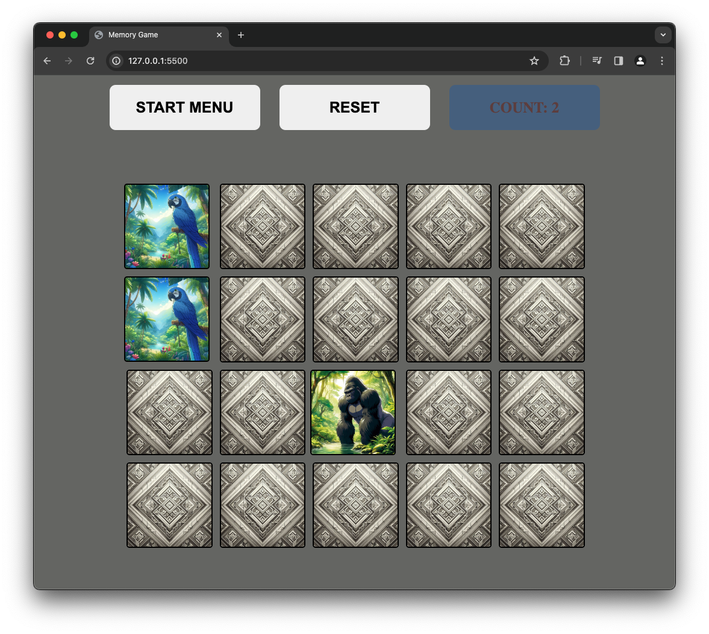

Experience the classic memory matching game in JavaScript! Flip cards to find matching pairs and challenge your memory skills. With a sleek interface and responsive design, play anytime, anywhere on any device. Customize difficulty and track your scores. Invite friends for friendly competition. Enjoy addictive gameplay and endless fun!

HOW TO RUN 
------------------------------------
* To get started, navigate to the Memory-card-game repository on GitHub and download the files. Then, open the folder in Visual Studio Code and launch the live server extension. This action  will automatically open the project in your default web browser.

Click here to view live:
[Visit website](https://08milam.github.io/Memory-card-game/)

TECHNOLOGY STACK USED
------------------------------------
* HTML
* CSS
* JavaScript

